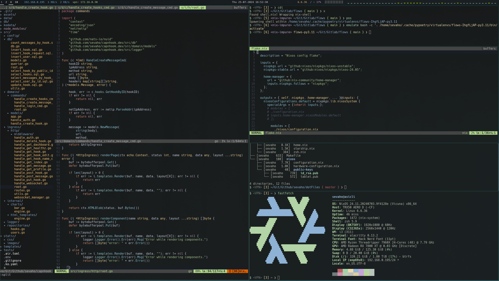

# Dotfiles

## Colors

- [Nordic](https://github.com/AlexvZyl/nordic.nvim)

## Fonts

- [Hack](https://github.com/ryanoasis/nerd-fonts/tree/master/patched-fonts/Hack) - *terminal font*

## Window Manager

- windows manager: i3
- status bar: polybar
- notifcation manager: dunst
- rofi: application launcher
- editor: nvim
- shell: zsh
- terminal: alacritty
- file-manager: yazi
- image file manager: sxiv

## Extra themes required

- Arc
- Shadow icons

